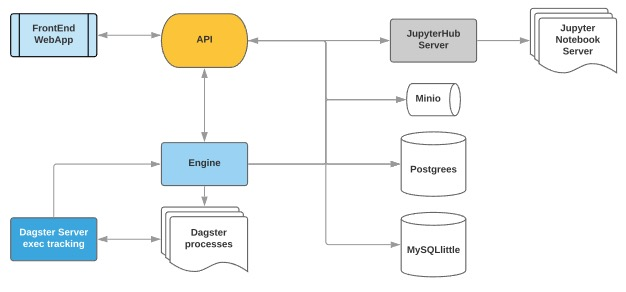

# The easier way to do machine learning with Python without coding!

### Intro

While developing our platform, we will like to use a Microservices architecture, for now as you can find in the different folders (apiMiddl, frontEnd, engine) we have made 3 and we are using [JupyterHub](https://jupyterhub.readthedocs.io/en/stable/) and [Minio](https://min.io/) services too, platform  can work without Minio but you will be only able to use your local CSV files in the Machine Learning Studio feature.

Then in order to have the platform running you need to run one by one all of them, we are working in one unique executable to make your life easy.

Let's take a look at our high level architecture

### Front-End

We call as Front-End the service which is responsible of running de Web application it is based on Veue.js framework, HTML and CSS, Vuetify and Bootstrap for style side. The most complext part of the Front-End the Machine Learning Studio uses following technologies JsPlumb, JQuery, JQurey-UI and Html2pdf for Javascript side. JsPlumb controls the machine learning nodes connection. JQurey-UI library control drag and drop the nodes. JQuery makes an easy and short Javascript code. Html2pdf for generating a pdf file. Vuetify and Bootstrap provide a beautiful element's style like the inputs, buttons and even animations. You can find how to run it and [more details here](https://github.com/elmpystudio/eps/blob/main/frontEnd/README.md)

### API

Our main service which orchestrates all communications between the Front-End and the rest of services is called API which has main responsibility of handling, security implementing OAuth authentication method for communicating with JupyterHub-Server, user management using SQLlittle as a storage, and acting as a proxy for Engine service, JupyterHub-Server and 
object storage. This service is based on Django you can see how to run it and all details [clicking here](https://github.com/elmpystudio/eps/blob/main/apiMiddl/README.md)

### Engine

The core of the machine learning studio build using Flask and [Dagster](https://dagster.io/) (kindly note we are using an old version of dagster updrading it is in our roadmap :grin: ). Our Engine service is where each one of the droppable functionalities are implemented and the one responsible of running them. In order to run the engine and the [details about it are here](https://github.com/elmpystudio/eps/blob/main/engine/README.md)

## Contribute 

We are open source and we ❤️ contributions big or small. [See our guide](https://github.com/elmpystudio/eps/blob/main/contribution.md) on how to get started.

## Get in touch 

We are working in our social networks and website, our commintment is focused on the code just [check our commintment statement](https://github.com/elmpystudio/eps/blob/main/COMMINTMENT.md).
For now you can contact directly to egomiciamur@elm.sa and if you want to know more about us [Check our division website](https://elm.sa/en/research-and-innovation/Pages/overview.aspx) 

