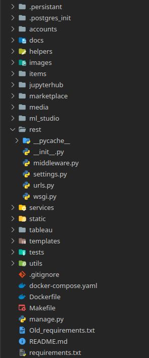
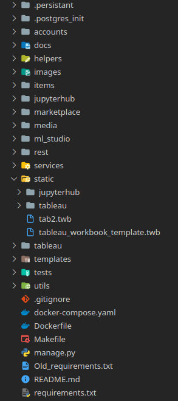
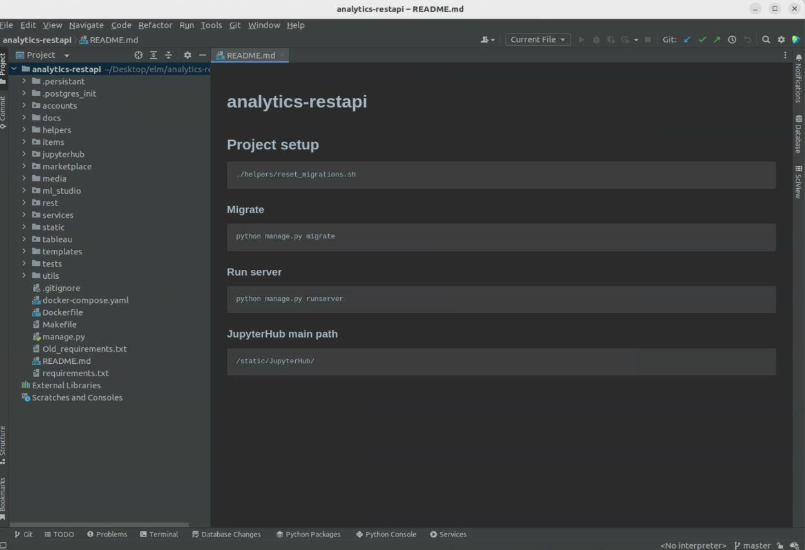
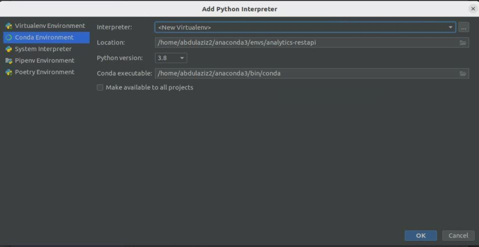
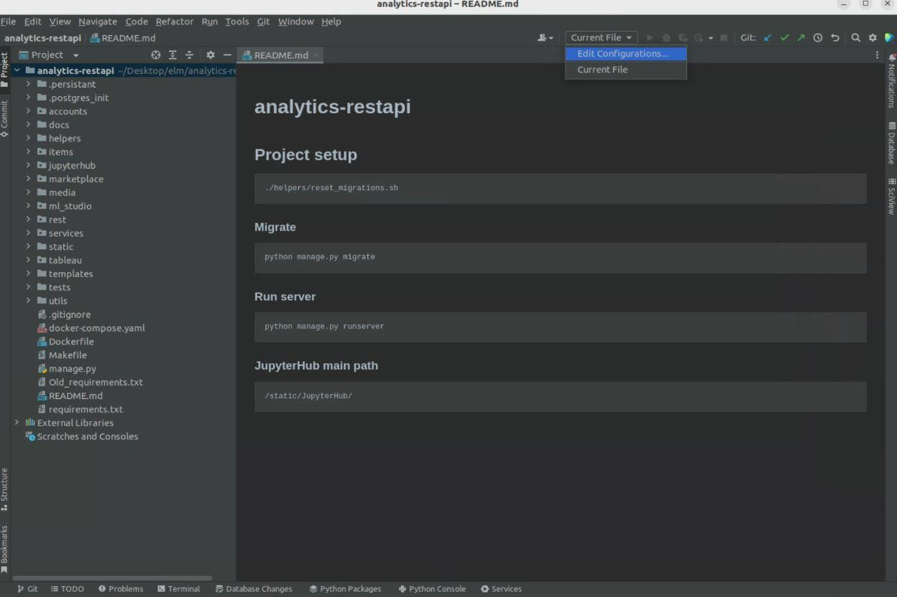
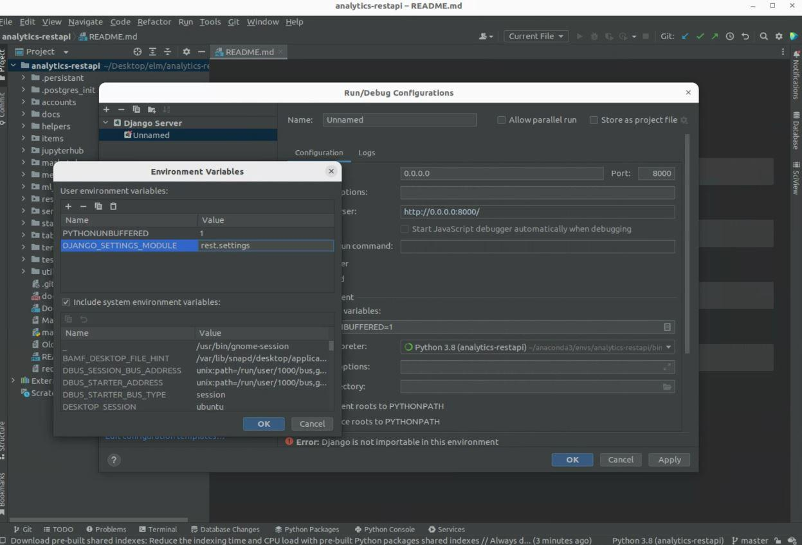

#  Elm's PyStudio - apiMiddl

## Project setup
```
./helpers/reset_migrations.sh
```

### Migrate
```
python manage.py migrate
```

### Run server
```
python manage.py runserver
```

- Kindly note that we followed [this guide](https://github.com/minrk/jupyterhub-pydata-2016/blob/master/JupyterHub.pdf) to have our JupyterHub server running.


# Project strucutre

Here you will find our project strucutre explanation, this will help you to understand better the application.
As you may know as a Django applciation we have two main folders, rest and the static.

 

### Root
At root level:
- .persistant, here you will find SLQLittle database, nginx configuration and minio. 
- .postgres_init, it has the creation script for our postgres database.

Bellow are the module related folders with tipicall django structure urls, views, serializers and fixtures:
- accounts, this module manages user account, roles, permissionss.
- helpers, contains helping scripts like, reset migrations and deploy.
- images, repo images.
- items, holds definitions of items in project like datasets, assets or visual analitics.
- jupyterhub, for handling jupyterhub integration.
- media, this is the storage for user images.
- ml_studio, integration with our aplication engine for the ML studio.
- rest, this is the default Django REST.
- ml_models, this integrate the engine ability to execute models as service.
- static, just some static data.
- tableau, project's endpoints with tableau definitions.
- templates, Django inherited admin page with our modifications.
- test, smoke tests written in pure python.
- utils, different functional stuff used across the project.

### Rest folder
At main levels rest folder:
- middleware.py, CORS configuration.
- settings.py, main configurations settings, database conections, main integration urls and so on.
- wsgi.py, basic django REST wsgi configurations.
- urls.py, main route API end points.

### Static folder
At main levels static folder:
- jupyterhub, settings for the jupyterhub app.
- tableau, settings for the tableau app, this is almost disable because for using tableau you need to pay a licence, it is a kind of legacy code we did as a trial. 
- tab2.twb and tableau_workbook_template.twb, are to examples related to tableau test.

## Installation with PyCharm

if you are a pycharm fan you can use bellow guide to set up your project.

### 1- Open the project
 

### 2- Go to settings and add an interpreter


### 3- In my case I will add a new conda environment as my interpreter


### 4- After adding the interpreter press ok


### 5- Now go to edit configurations


### 6- Add a Django server with these settings specified in the figure below and press ok


### 7- Now that our Django server is setup we need to install all of the packages specified in requirements.txt by pressing install requirements, or by opening a terminal and writing
```
pip install -r requirements.txt
```


### 8- Installing packages


### 9- Now that all of the packages its time to open a terminal and setup the project, by writing 
```bash
./helpers/reset_migrations.sh
```


### 10- Migrating the project
```bash
python manage.py migrate
```


### 11- Lastly running the server
```bash
python manage.py runserver
```


### 12- Now the restapi should be running and the frontend should be functional

