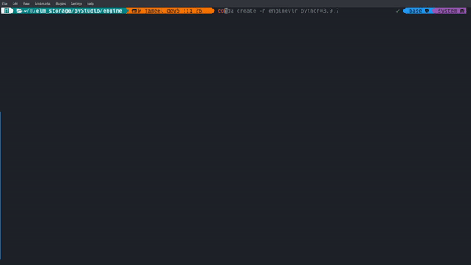
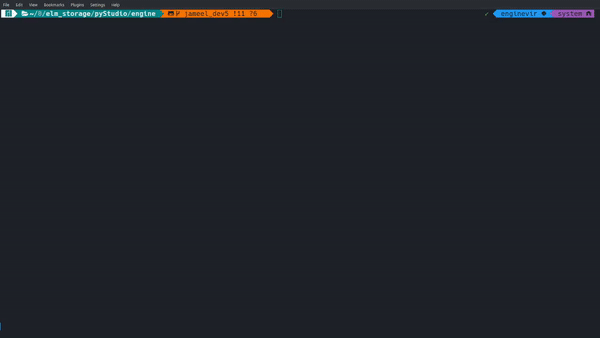
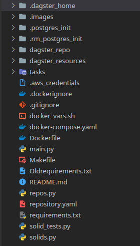
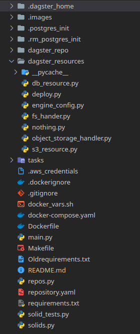
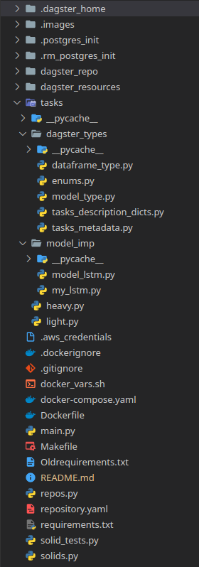

#  Elm's PyStudio - Engine

## Enviroment setup:

1.Make a private enviroment in python 3.9:
```bash
conda create -n {{ENV_NAME}} python=3.9
```


2.Install required libraries:
```bash
pip install -r requirements.txt
```


3.Run server
```
flask --app main run
```


# Setup Minio storage.
## Run minio docker:
1. Run docker command to pull and run minio or create a bucket named "dagster-test":  
    * ```bash
      docker run -d -p 9001:9000 --name minio_test -e "MINIO_ACCESS_KEY=user" -e "MINIO_SECRET_KEY=Aa123456" -e "MINIO_BUCKET=dagster-test" -v minio_data:/data -v minio_config:/root/.minio minio/minio:RELEASE.2019-04-09T01-22-30Z server /data
      ```

## Create .AWS folder with credentials:

1. Create .aws folder in path /home/"user"/ with credentials and config files:
    * ```bash
      mkdir $HOME/.aws
      ```
    * ```bash
      touch $HOME/.aws/credentials $HOME/.aws/config
      ```
2. in credentials write your minio username and id or follow:  
    * ```yaml
      [default]  
      aws_access_key_id=user
      aws_secret_access_key=Aa123456
      ```
3. in config write your region and output as json or follow:  
    * ```yaml
      [default]  
      region=us-west-2  
      output=json
      ```
<br>

# Setup Postgres storage.
## Run postgres docker:
1. Run docker command to pull and run postgres or create ("test_run_storage", "test_event_log_storage", and "test_schedule_storage" databases):
    * ```bash
      docker run -p 5432:5432 --name postgres -e POSTGRES_PASSWORD=Aa123456 -d postgres
      ```
2. Enter the postgres container and create the 3 needed databases:
    * ```bash
      sudo docker exec -it postgres bash
      ```
    * ```bash 
      psql -U postgres
      ```
    * ```bash
      CREATE DATABASE test_run_storage; CREATE DATABASE test_event_log_storage; CREATE DATABASE test_schedule_storage;
      ```
    * ```bash
      exit
      ```
    * ```bash
      exit
      ```
<br>

# Environment and packages.

1. Add the following configuration to dagster.yaml file:
    *   ```yaml
        run_storage:
        module: dagster_postgres.run_storage
        class: PostgresRunStorage
        config:
            postgres_db:
            username: postgres
            password: Aa123456
            hostname: localhost
            db_name: test_run_storage
            port: 5432

        event_log_storage:
        module: dagster_postgres.event_log
        class: PostgresEventLogStorage
        config:
            postgres_db:
            username: postgres
            password: Aa123456
            hostname: localhost
            db_name: test_event_log_storage
            port: 5432

        scheduler:
        module: dagster_cron.cron_scheduler
        class: SystemCronScheduler

        schedule_storage:
        module: dagster_postgres.schedule_storage
        class: PostgresScheduleStorage
        config:
            postgres_db:
            username: postgres
            password: Aa123456
            hostname: localhost
            db_name: test_schedule_storage
            port: 5432

        local_artifact_storage:
        module: dagster.core.storage.root
        class: LocalArtifactStorage
        config:
            base_dir: "/var/shared/dagster"
        ```
3. Add dagster home folder path to environment variable "DAGSTER_HOME":
    * Add the following to bashrc:
        * ```bash
          export DAGSTER_HOME=$HOME/dagster_home
          ```
    * Create folder for local artifacts:
        * ```bash
          mkdir /var/shared/dagster
          ```
# Project strucutre
Here you will find our project strucutre explanation, this will help you to understand better the application.
As you may know as a Flask applciation we have two main folders, dagster_resources and the tasks.

   

### Root
At root level:
- .aws_credentials, we use aws way to connect to our own files as need it by dagster
- .dagster_home/, dagster will use this for temporal files output
- .dockerignore, ignore some stuff for our docker build
- .git/ & .gitignore,  you know about that
- .images/, related to this README
- .postgres_init/, script for db creation
- Dockerfile, our container for this service
- Makefile, for running the container
- Oldrequirements.txt, some legacy requirements file
- README.md, here we are
- dagster_resources/, all you need for dagster
- docker-compose.yaml & docker_vars.sh,, docker stuff
- main.py, the rest application starting point
- requirements.txt, library list dependencies
- solid_tests.py, some old test that had been done
- solids.py, the main course is here, where you will find the funtionality for each single node
- tasks/ all the necesary to run the different task related to the solids

### Dagster_resources
At dagster_resources level:
- db_resource.py, database connector for dagster, all configuration
- engine_config.py, all engine configuration, databases & handlers conections and some env variable creation
- fs_hander.py, we deal with some files as temporal outputs, here you can find all funtionality
- object_storage_handler.py, the minio interface

### Tasks
At tasks level:
- dagster_types/, 
  - dataframe_type.py, here you will find the runtime outputs of different task running in dagster
  - enums.py, some constants used in our syste
  - model_type.py, this one complements dataframe_type
  - tasks_description_dicts.py, all task declaration, each funtion in solids must be declarated here
  - tasks_metadata.py, this prepare the output for each task execution result
- model_imp/, a place to put the models that you can integrate in the platform
  - model_lstm.py, an example of native implementation of LSTM
  - my_lstm.py, complements model_lstm
- heavy.py, this is not in use, it is planned for a kafka cluster execution
- light.py, this is one computer task execution general classes


