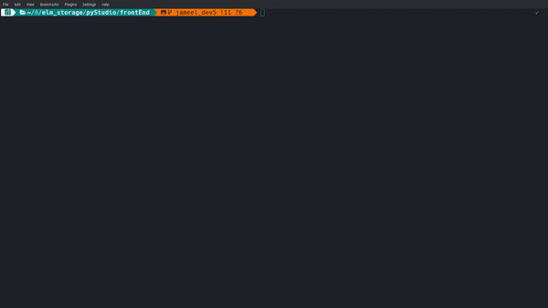
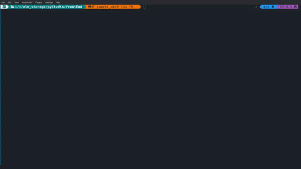
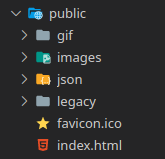
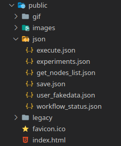
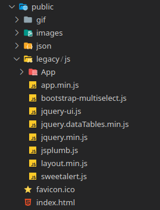
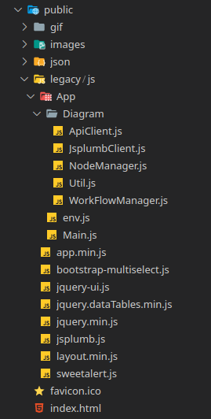
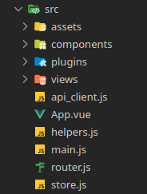
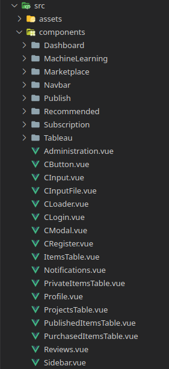
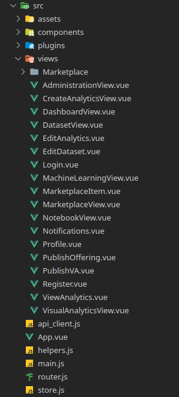

# Elm's PyStudio - frontEnd


### Project setup
```bash
npm install
```



### Compiles and hot-reloads for development
```bash
npm run serve
```


### Compiles and minifies for production
```bash
npm run build
```


### Lints and fixes files
```bash
npm run lint
```



# Project strucutre

Here you will find the explanation for the folders strucutre for our project, this will help you to understand better the components.
As you may know as a Veu.js applciation we have two main folders, public and the src, we will start with the public folder below.

### Pubic folder

#### This folder is related only to the Machine Learning (ML) feature.

   

At this level you can see Json and Legacy, Json Folder contains a fake data for testing the ML feature while doing development you maybe will not even use that one. 
The Legacy Folder contains The Machine Learning App and and dependency libraries, like Bootstrap, Jquery-UI and JSplumb.

The Diagram app folder is where the main curse is served, it contains:
- ApiClient.js where you will find all API calls need it for ML feature.
- JsplumbClient.js is the main controller for the diagram and nodes, it works as an interface to the JSplumb library.
- NodeManager.js is responsible for diagram node connections.
- Util.js has some general and utitlity functions.
- WorkFlowManager.js responsible for handling all diagram actions.

### SRC folder

  


At main levels src folder:
- api_client.js, configuration URL pointing to our API, and contains all the api calls, basically our API client.
- App.vue, this is the root page.
- helpers.js, contains a function for clear the token or login session.
- main.js, this is the main file for the Vue.js App.
- store.js, this is for global variables. 
- router.js, this for thee routes.
- plugin, contains a Vue.js plugins, like Vuetify.
- assets, contains static files and icons for entire app.
- views, contains the main pages.
- components, contains multiple of components each component is piece of code can be used everywhere, like a function.

At component folder:
- Dashboard, custom table components only for the dashboard.
- MachineLearning, custom components only for the MachineLearning.
- Marketplace, custom components only for the Marketplace.
- Navbar, custom navbar style.
- Publish, custom components only for the publish.
- Recommended, custom components only for the ReportView.
- Subscription, custom components only for the ReportView.
- Tableau, custom components only for the VisualAnalytics.
- Administration, for admin page.
- CButton, custom button style.
- CInput, custom input style.
- CInputFile, custom input style for uploading.
- CLoader, custom spinner loader.
- CLogin, custom login style.
- CModal, custom popup modal.
- CRegister, custom register style. 
- ItemTable, custom table for items.
- Notification, custom notification style.
- PrivateItemsTable, custom table for private items.
- Profile, custom profile style.
- ProjectsTable, custom table for projects.
- PublisheditItemsTable, custom table for published items.
- PurchasedItemsTable, custom table for purchased items.
- Reviews, custom reviews style items.
- Sidebar, custom sidebar style.

At views folder you will find all the main page for the components.
- AdministrationView.vue, main page of Administration.
- CreateAnalyticsView.vue, main page of Create Analytics.
- DashboardView.vue, main page of Dashboard.
- DatasetView.vue, main page of Dataset.
- EditAnalytics.vue, main page of Edit Analytics.
- EditDataset.vue, main page of Edit Dataset.
- Login.vue, main page of Login.
- MachineLearningView.vue, main page of Machine Learning.
- Marketplace, main page of Marketplace.
- MarketplaceItem.vue, main page of Marketplace Items.
- MarketplaceView.vue, main page of Marketplace.
- NotebookView.vue, main page of Notebook.
- Notifications.vue, main page of Notifications.
- Profile.vue, main page of Profile.
- PublishOffering.vue, main page of Publish Offering.
- PublishVA.vue, main page of Publish.
- Register.vue, main page of Register.
- ViewAnalytics.vue, main page of Analytics.
- VisualAnalyticsView.vue, main page of Visual Analytics.

### If you wanbt to customize vuejs configuration
See [Configuration Reference](https://cli.vuejs.org/config/).
